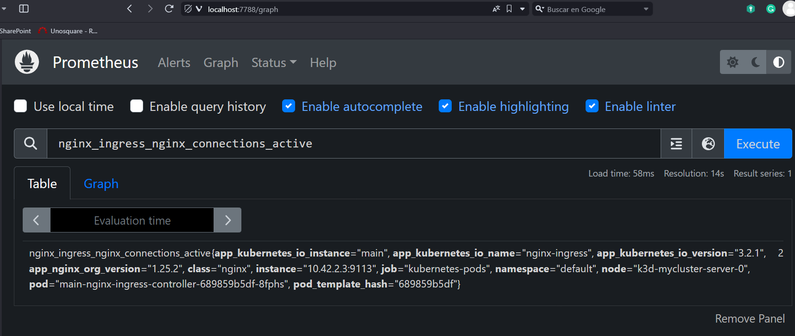
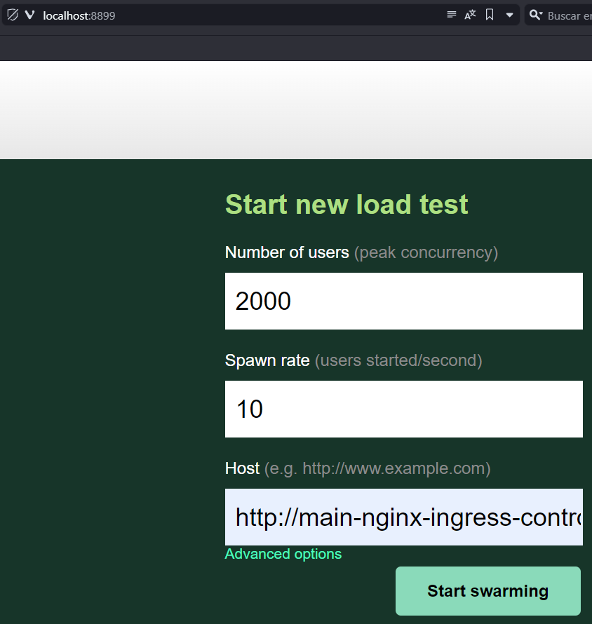
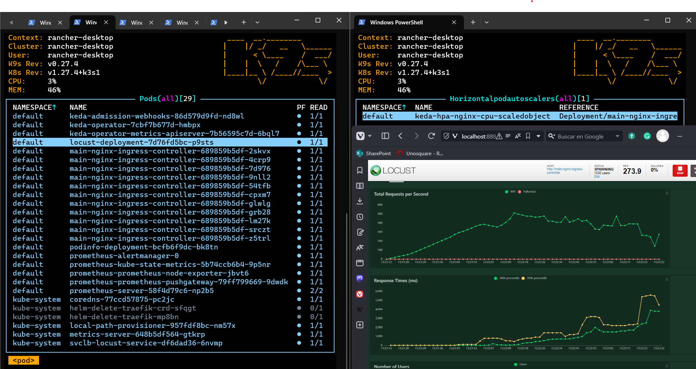

# Autoscalling - Based on Traffic

Hello fella! We are going to set a really god example on how to autoscale Pods based on traffic

- Deploy and go
- Undertan

## Deploy and go

### 0. Deploy Cluster

Auto cluster

```shell
k3d cluster create --config .\00_k3d_cluster\00_myk3dcluster.yaml
```

### 1. Deploy kubernetes fun stuff

Funky Pods

```shell
kubectl apply -f .\01_kubernetes\
```

### 2. Need Nginx Pod to work right     ?

1. Adding repo

We are just adding the _repo_

```sh
helm repo add nginx-stable https://helm.nginx.com/stable
helm repo update
```

2. Now create the _Pod_ via _helm_

```sh
helm install main nginx-stable/nginx-ingress --set controller.watchIngressWithoutClass=true
```

3. Forward (Just to test it)

```shell
kubectl port-forward service/main-nginx-ingress-controller 80:80
```

4. <ins>Test It!</ins>

Need to pass a Header

```sh
curl -H "Host: my.podinfo.local" 127.0.0.1
```

**NOTE**: Json should appear

4. (Optional) Edit your hosts file

Add

```
127.0.0.1 my.podinfo.local
```

Come on access it: http://my.podinfo.local

### 3. Prometheus

We need some tool to get insigths soooooo Prometheus (The one that rules)

1. Adding repo

We are just adding the _repo_

```shell
helm repo add prometheus-community https://prometheus-community.github.io/helm-charts
helm repo update
```

2. Now create the _Pod_ via _helm_

```sh
helm install prometheus prometheus-community/prometheus
```

3. Forward

```shell
kubectl port-forward service/prometheus-server 7788:80
```

3. <ins>Test It!</ins>

http://localhost:7788

## Metrics

Reading the [docs](https://github.com/nginxinc/nginx-prometheus-exporter#metrics-for-nginx-oss) we can understand some default metrics that nginx export

- `nginx_connections_active`

We are interest in the metrics

- `nginx_ingress_nginx_connections_active`



## Locust

Stress opensource tool! Check it out [https://locust.io](https://locust.io)

1. Deploy

```shell
kubectl apply -f .\02_locust\
```

3. Forward

```shell
kubectl port-forward service/locust-service 8899:8089
```

3. <ins>Test It!</ins>

http://localhost:8899

## Keda

1. Adding repo

We are just adding the _repo_

```shell
helm repo add kedacore https://kedacore.github.io/charts
helm repo update
```

2. Now create the _Pod_ via _helm_

```shell
helm install keda kedacore/keda
```

3. Scaled Object

```shell
kubectl apply -f .\03_keda\
```

**Note**: Keep an eye on the `query` (Most important)

## Result

### Locust

Run locust



### Automatic pod creation



## Related Doc/Video

- Must watch [video](https://www.youtube.com/watch?v=6uQi774ZhqQ)
- [Nginx Metrics](https://github.com/nginxinc/nginx-prometheus-exporter#metrics-for-nginx-oss)
- [Stress Testing Tool](https://locust.io)
- [Stress Testing Toll - As Image](https://hub.docker.com/r/locustio/locust)
- [Keda Auto Scaler](https://keda.sh)