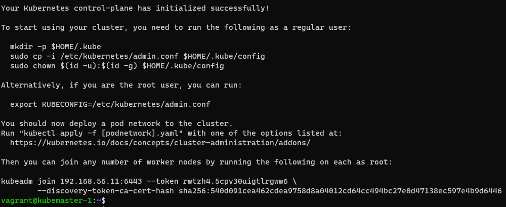

# Kubernetes VMs

Here we are starting the configuration

## Connect

```shell
vagrant ssh <name_of_vm>
```

<ins>Example</ins>

```shell
vagrant ssh kubemaster-1
```

## Manual Provisioning

In case you want to provision

```shell
vagrant provision --provision-with <name_of_script>
```

**NOTE:** Is calling the name of _vm.provision_ inside ("") in the vagrant file

<ins>Example</ins>

In _masterNodeConfig.vm.provision_ & _workerNodeConfig.vm.provision_ there is one "setup-hosts"

```shell
vagrant provision --provision-with setup-hosts
```

## Steps

There will be some uncommented steps

### 1. Bridge traffic

```shell
vagrant provision --provision-with 01_bridge_traffic
```

### 2. Verify Netmodules

```shell
vagrant provision --provision-with 02_verify_netmodules
```

<ins>Expected</ins>

|Module|Size|Used|by|
|-|-|-|-|
|br_netfilter|(Some size)|0||
|bridge|(Some size)|1|br_netfilter|
|overlay|(Some size)|0||

### 3. Verify System Variables

```shell
vagrant provision --provision-with 03_verify_sysvar
```

<ins>Expected</ins>

```
net.bridge.bridge-nf-call-iptables = 1
kubemaster-1: net.bridge.bridge-nf-call-ip6tables = 1
kubemaster-1: net.ipv4.ip_forward = 1
```

### 4. ContainerD with apt

Because we use Ubuntu and we will be using apt for the installation

```shell
vagrant provision --provision-with 04_containerd
```

### 5. Cgroup driver (Systemd)

There are two cgroup drivers:

- cgroupfs
- systemd

You have to peak one depending on your system, kubelet should match

<ins>How to know?</ins>

```shell
ps -p 1
```

### 6. Installing kubeadm, kubelet and kubectl

- **kubeadm**: the command to bootstrap the cluster.
- **kubelet**: the component that runs on all of the machines in your cluster and does things like starting pods and containers.
- **kubectl**: the command line util to talk to your cluster.

```shell
vagrant provision --provision-with 06_install_kkk
```

## Kubemaster

Specially read next [doc](https://kubernetes.io/docs/setup/production-environment/tools/kubeadm/create-cluster-kubeadm/#initializing-your-control-plane-node)

### 1. Configure kubeadm

**EXECUTE ONLY IN MASTER NODE**

<ins>Explain</ins>

```shell
sudo kubeadm init --pod-network-cidr=<pods_cidr_block> --apiserver-advertise-address=<master_node_server>
```

<ins>If default parameters</ins>

```shell
sudo kubeadm init --pod-network-cidr=10.244.0.0/16 --apiserver-advertise-address=192.168.56.11
```

<ins>Result</ins>

What is a similar expected



## Reference

- [Install kubeadm](https://kubernetes.io/docs/setup/production-environment/tools/kubeadm/install-kubeadm/)
- [Install containerd](https://github.com/containerd/containerd/blob/main/docs/getting-started.md)
- [Configuring the systemd cgroup driver](https://kubernetes.io/docs/setup/production-environment/container-runtimes/#containerd-systemd)
